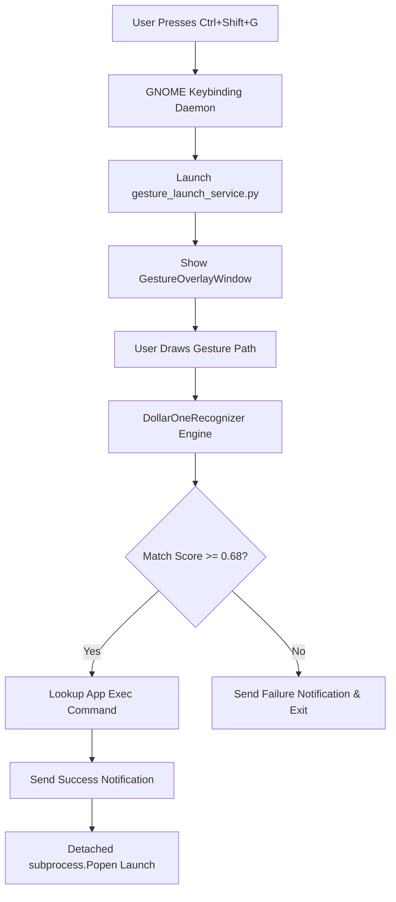

# Gesture Launch 🚀

Gesture Launch is a modern desktop application for Ubuntu/Linux that allows users to launch installed applications using custom drawn touchpad/mouse gestures on a transparent screen overlay.

---

## Overview

Gesture Launch provides a fast, mouse- and touchpad-driven workflow for opening applications on Linux (GNOME). Users press a global activation keybinding to open a fullscreen transparent drawing overlay, draw a pre-recorded unistroke shape, and automatically trigger the corresponding application.

### Key Highlights
- **Zero-Footprint Idle Daemon Strategy**: Integrates directly into GNOME's `gsettings` custom keybinding daemon (`org.gnome.settings-daemon.plugins.media-keys`), executing an on-demand launcher process (`gesture_launch_service.py`) only when triggered.
- **$1 Unistroke Recognition Engine**: Resamples, scales, and normalizes candidate paths using the $1 Unistroke algorithm, evaluating similarity against saved gesture templates independently of drawing speed or stroke scale.
- **Automatic Linux Application Discovery**: Scans standard desktop entry directories (`/usr/share/applications`, `~/.local/share/applications`, `/var/lib/snapd/desktop/applications`) to auto-populate launchable GUI applications.
- **Persistent JSON Configuration**: Saves user-defined stroke paths in JSON format under `~/.config/gesture-launch/gestures.json`.

---

## Demo

https://github.com/user-attachments/assets/9e0ec681-06fa-4f63-aafd-1994c8e1bb0f

> *Watch Gesture Launch open applications on Ubuntu using custom drawn overlay gestures.*

---

## Features

- **Transparent Screen Overlay**: Fullscreen semi-transparent Qt overlay with smooth anti-aliased glowing stroke visualizer.
- **$1 Unistroke Gesture Recognition**: Robust shape matching with configurable similarity thresholds.
- **GNOME Shortcut Integration**: Toggle GNOME custom keybinding (`Ctrl + Shift + G`) directly from the settings page.
- **Application Studio & Management**: Browse discovered Linux and Snap applications, record custom gesture templates, filter by gesture status, and search by name.
- **Desktop Notifications**: Instant notification feedback on gesture match or failure via `notify-send`.
- **Modern Qt6 / PySide6 Interface**: Styled with Catppuccin-inspired dark themes and responsive navigation pages.

---

## How It Works



1. **Triggering**: Pressing `Ctrl + Shift + G` causes GNOME's media-keys daemon to execute `gesture_launch_service.py`.
2. **Drawing**: The overlay window (`GestureOverlayWindow`) activates fullscreen to capture mouse/touchpad coordinate points (`Point`, `Stroke`).
3. **Matching**: Drawn strokes are passed to `DollarOneRecognizer.recognize()`, which normalizes candidate points and computes distance scores against templates loaded from `GestureRepository`.
4. **Execution**: If the top score exceeds `0.68`, `launch_application()` executes the parsed desktop `Exec` command as a detached background process, followed by a system desktop notification.

---

## Technology Stack

- **GUI Framework**: PySide6 (Qt 6 for Python)
- **Gesture Engine**: Custom $1 Unistroke Gesture Recognition algorithm
- **Desktop Environment Integration**: GNOME `gsettings` (`org.gnome.settings-daemon.plugins.media-keys`), `notify-send`
- **Configuration & Storage**: Standard Library `json`, `configparser`, `pathlib`
- **Dependency & Environment Management**: `uv`

---

## Requirements

### Runtime Requirements
- **OS**: Linux / Ubuntu (GNOME Desktop Environment required for keybinding registration & `gsettings`)
- **Python**: Python 3.14+ (or Python 3.10+)
- **System Utilities**: `gsettings`, `notify-send` (provided by `libnotify-bin`)

### Development Requirements
- [`uv`](https://github.com/astral-sh/uv) project manager

---

## Installation & Setup

1. **Clone the Repository**:
   ```bash
   git clone https://github.com/rajendravaddi/GestureLaunch.git
   cd GestureLaunch
   ```

2. **Install Dependencies with `uv`**:
   ```bash
   uv sync
   ```

---

## Running From Source

Launch the main management GUI:
```bash
uv run main.py
```

Run the on-demand gesture launcher service directly (for testing overlay recognition):
```bash
uv run gesture_launch_service.py
```

---

## Usage

### 1. Enable Keybinding Integration
1. Run `uv run main.py`.
2. Click **Settings** (gear icon in the top toolbar).
3. Toggle **Gesture Launch service** to **ON**.
4. This executes `gsettings` commands to register `Ctrl + Shift + G` targeting your project virtualenv python path and `gesture_launch_service.py`.

### 2. Record Application Gestures
1. Navigate to **Applications**.
2. Select an application card (or use the search bar / filter options).
3. Click **Record Gesture** on the application detail page.
4. Draw a single-stroke shape on the interactive canvas.
5. Click **Save Gesture**.

### 3. Launching Applications
1. Press `Ctrl + Shift + G` anywhere on your desktop.
2. Draw your saved shape on the transparent overlay.
3. Upon mouse release, the app recognizes the shape, displays a desktop notification, and launches your application!

---

## Application Discovery

Gesture Launch scans standard Linux desktop entry locations:
- `/usr/share/applications` (Standard system apps)
- `~/.local/share/applications` (User-installed apps)
- `/var/lib/snapd/desktop/applications` (Snap desktop entries)

It parses `.desktop` files using `configparser`, filters out `NoDisplay=true`, `Hidden=true`, or non-Application entries, and strips field codes (`%f`, `%u`, `%U`, etc.) from `Exec` commands to construct clean launch commands.

---

## Configuration and Data

User gesture templates are stored locally in JSON format at:
```
~/.config/gesture-launch/gestures.json
```

### JSON Data Format Example
```json
{
  "uuid-string": {
    "id": "uuid-string",
    "app_id": "firefox",
    "name": "Firefox Web Browser",
    "created_at": 1723890000.0,
    "updated_at": 1723890000.0,
    "strokes": [
      {
        "points": [
          {"x": 0.12, "y": 0.34},
          {"x": 0.15, "y": 0.38}
        ]
      }
    ]
  }
}
```

---

## Project Structure

```
GestureLaunch/
├── app/
│   ├── models/                  # Dataclasses (Application, Gesture, Point, Stroke, Settings)
│   ├── pages/                   # Qt Page views (ApplicationsPage, ApplicationPage, SettingsPage, HelpPage)
│   ├── repository/              # Persistence layer (GestureRepository, SettingsRepository)
│   ├── resources/styles/        # QSS Qt stylesheets (main.qss)
│   ├── services/                # Business logic services (ApplicationService, GestureService)
│   ├── utils/                   # System helpers (desktop_parser, gesture_matcher, gnome_shortcut_manager, launcher, notifier)
│   ├── widgets/                 # Custom Qt widgets (GestureOverlayWindow, GestureCanvas, ApplicationCard, etc.)
│   ├── main_window.py           # Main Window container
│   └── navigation.py            # Navigation controller for QStackedWidget
├── assets/
│   └── gesture_launch_demo.mp4  # Demo video asset
├── docs/
│   └── Architecture.md          # Technical Architecture documentation
├── gesture_launch_service.py    # On-demand headless gesture launcher entry point
├── main.py                      # Main GUI management app entry point
├── pyproject.toml               # Project metadata & dependencies
└── README.md                    # Project documentation
```

---

## Technical Architecture

For complete internal details on algorithm implementation, startup sequence, data flow, and GNOME integration, see [docs/Architecture.md](docs/Architecture.md).

---

## Known Limitations

- **GNOME Desktop Only**: Shortcut registration depends on GNOME `gsettings` (`org.gnome.settings-daemon.plugins.media-keys`). Other desktop environments (KDE, XFCE) require manual shortcut configuration pointing to `gesture_launch_service.py`.
- **Single-Screen Overlay Positioning**: `GestureOverlayWindow` positions itself over the active primary screen geometry.
- **Unistroke Resampling Limit**: Multi-stroke gestures are flattened during recognition, so single continuous strokes yield the best accuracy.

---

## License

No explicit license file is currently specified in this repository.
