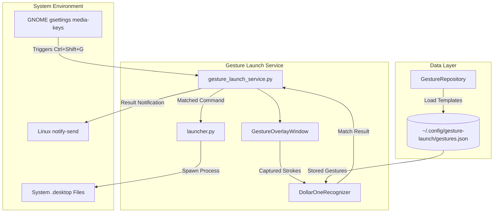

# Gesture Launch Architecture

This document details the internal architecture, component design, data flow, and Linux system integration of **Gesture Launch**.

---

## 1. Architecture Overview

Gesture Launch uses a decoupled architecture split into two main executables:
1. **Management GUI (`main.py`)**: A PySide6 desktop application for browsing installed applications, recording gesture templates, and configuring system keybindings.
2. **On-Demand Launcher Daemon (`gesture_launch_service.py`)**: A lightweight Python script executed on demand when the global activation hotkey is pressed.



---

## 2. Application Components

| Component | Path | Responsibility |
|---|---|---|
| **Entry Point (GUI)** | `main.py` | Initializes `QApplication` and displays `MainWindow`. |
| **Entry Point (Service)** | `gesture_launch_service.py` | On-demand service launched by GNOME keybinding to present transparent overlay and execute matched commands. |
| **Main Window** | `app/main_window.py` | Container window hosting `QStackedWidget` pages and centralized services. |
| **Navigation Controller** | `app/navigation.py` | Manages page transitions across Applications, Application Details, Settings, and Help pages. |
| **$1 Gesture Matcher** | `app/utils/gesture_matcher.py` | Implementation of the $1 Unistroke Gesture Recognition algorithm (`DollarOneRecognizer`). |
| **Desktop Parser** | `app/utils/desktop_parser.py` | Scans system `.desktop` entry paths and extracts application metadata. |
| **GNOME Shortcut Manager** | `app/utils/gnome_shortcut_manager.py` | Interacts with `gsettings` to register/unregister the `Ctrl + Shift + G` keybinding. |
| **Launcher Utility** | `app/utils/launcher.py` | Spawns detached subprocesses (`subprocess.Popen`) to execute applications. |
| **Notifier Utility** | `app/utils/notifier.py` | Triggers Linux desktop notifications via `notify-send`. |
| **Overlay Window** | `app/widgets/overlay_window.py` | Fullscreen transparent Qt widget capturing mouse/touchpad gesture paths. |
| **Gesture Canvas** | `app/widgets/gesture_canvas.py` | Interactive drawing canvas used in the Application Studio page to record gestures. |
| **Gesture Repository** | `app/repository/gesture_repository.py` | Reads/writes user gesture templates to JSON file. |

---

## 3. Application Startup

### Management GUI Startup (`main.py`)
1. `main()` instantiates `QApplication(sys.argv)`.
2. `MainWindow` initializes `GestureRepository` and `SettingsRepository`.
3. `ApplicationService` and `GestureService` instance singletons are created.
4. `MainWindow` loads `app/resources/styles/main.qss` stylesheet.
5. Pages (`ApplicationsPage`, `ApplicationPage`, `SettingsPage`, `HelpPage`) are created and added to `QStackedWidget`.
6. `NavigationController.go_to_applications()` displays the default landing view.

### Launcher Service Startup (`gesture_launch_service.py`)
1. `gesture_launch_service.py` is executed by GNOME keybinding daemon.
2. Creates `QApplication` with `setQuitOnLastWindowClosed(True)`.
3. Loads `GestureRepository` from `~/.config/gesture-launch/gestures.json`.
4. Instantiates `ApplicationService` to discover installed applications.
5. Instantiates `GestureOverlayWindow` and invokes `activate_overlay()`.
6. Fullscreen transparent overlay displays on screen, waiting for user input.

---

## 4. Gesture Recognition Flow

Gesture recognition is powered by `DollarOneRecognizer` (`app/utils/gesture_matcher.py`), implementing the $1 Unistroke algorithm.

```
Captured Strokes -> Flatten Points -> Resample (64 pts) -> Scale to Bounding Box (100x100) -> Translate Centroid to Origin -> Path Distance Comparison -> Score Calculation
```

### Recognition Steps:
1. **Flattening**: Input `Stroke` points are flattened into a 2D coordinate array `[(x, y), ...]`.
2. **Resampling**: Path is resampled into $N = 64$ equidistant points along the total path length.
3. **Scaling**: Scaled non-uniformly to fit a $100 \times 100$ square bounding box.
4. **Translation**: Centroid of points is translated to $(0, 0)$.
5. **Distance Metric**: Evaluates average Euclidean distance between normalized candidate points and stored gesture template points.
6. **Scoring**: Confidence score is calculated as:
   $$\text{Score} = \max\left(0.0, 1.0 - \frac{\text{Distance}}{\frac{\sqrt{2} \times 100}{2}}\right)$$
7. **Thresholding**: If top match score $\ge 0.68$ (`MATCH_THRESHOLD`), the gesture is matched; otherwise rejected.

---

## 5. Gesture-to-Application Mapping

- Each gesture template (`Gesture` model) stores an `app_id` string matching the `.desktop` file stem (e.g., `firefox`, `org.gnome.Terminal`).
- Gestures are indexed by `app_id` in `GestureRepository`.
- During recognition in `gesture_launch_service.py`:
  - Candidate strokes are matched against all templates with non-empty strokes.
  - If a match is found, `app_service.get_application_by_id(matched_gesture.app_id)` retrieves the `Application` object to obtain `exec_command`.

---

## 6. Application Discovery Architecture

Application discovery is handled by `scan_desktop_applications()` in `app/utils/desktop_parser.py`.

### Search Directories:
- `/usr/share/applications` (Standard system Linux applications)
- `~/.local/share/applications` (User-specific desktop entries)
- `/var/lib/snapd/desktop/applications` (Snap application entries)

### Parsing & Filtering Rules:
1. Iterates over all `.desktop` files in target directories.
2. Uses Python's `configparser.ConfigParser(interpolation=None)`.
3. Verifies `[Desktop Entry]` section exists.
4. Filters out entries where:
   - `Type != "Application"`
   - `NoDisplay == True`
   - `Hidden == True`
5. Deduplicates applications using `filepath.stem` as `app_id`.
6. Cleans `Exec` field codes (`%f`, `%F`, `%u`, `%U`, `%i`, `%c`, `%k`) by stripping tokens starting with `%`.

---

## 7. Application Launching

Application launching is executed by `launch_application(exec_command: str)` in `app/utils/launcher.py`.

### Execution Implementation:
```python
subprocess.Popen(
    exec_command,
    shell=True,
    start_new_session=True,
    stdout=subprocess.DEVNULL,
    stderr=subprocess.DEVNULL,
)
```
- **Detached Session (`start_new_session=True`)**: Ensures the launched process creates its own process group, allowing it to remain running independently after `gesture_launch_service.py` exits.
- **`shell=True`**: Allows complex binary commands or environment variable flags in `.desktop` `Exec` lines to be interpreted cleanly by bash/sh.
- **I/O Redirection**: `stdout` and `stderr` are sent to `DEVNULL` to prevent blocking file descriptors.

---

## 8. Configuration and Persistence

- **File Path**: `~/.config/gesture-launch/gestures.json`
- **Parent Directory**: Created automatically via `mkdir(parents=True, exist_ok=True)`.
- **Data Model**:
  - `Gesture`: `id`, `app_id`, `name`, `created_at`, `updated_at`, `strokes`
  - `Stroke`: List of `Point` dataclasses (`x`, `y` floats normalized between `0.0` and `1.0`).
- **Read/Write Flow**: `GestureRepository` loads JSON data on initialization and writes formatted JSON (`indent=2`) whenever `save()` or `delete()` is called.

---

## 9. UI Architecture

The UI is built with PySide6 using a clean component hierarchy:

- **`MainWindow` (`app/main_window.py`)**: Root QMainWindow managing central `QStackedWidget`.
- **`NavigationController` (`app/navigation.py`)**: Handles page switches (`go_to_applications`, `go_to_application_details`, `go_to_settings`, `go_to_help`).
- **Pages**:
  - `ApplicationsPage`: Displays searchable/filterable grid of `ApplicationCard` widgets.
  - `ApplicationPage`: Detail view containing `GestureCanvas` for recording/testing gesture shapes.
  - `SettingsPage`: Displays global hotkey info and `ToggleSwitch` for GNOME keybinding service integration.
  - `HelpPage`: Instructions and troubleshooting steps.
- **Styles**: Custom dark theme stylesheet (`app/resources/styles/main.qss`).

---

## 10. Packaging & System Integration Architecture

### GNOME Keybinding Integration (`gnome_shortcut_manager.py`)
Interacts with GNOME `gsettings` via `subprocess.run`:
- Base schema: `org.gnome.settings-daemon.plugins.media-keys`
- Custom shortcut path: `/org/gnome/settings-daemon/plugins/media-keys/custom-keybindings/gesture-launch/`
- Custom schema: `org.gnome.settings-daemon.plugins.media-keys.custom-keybinding:<PATH>`
- Registered command: `<PROJECT_ROOT>/.venv/bin/python <PROJECT_ROOT>/gesture_launch_service.py`
- Default keybinding: `<Control><Shift>g`

---

## 11. Development vs Packaged Runtime

| Feature / Aspect | Development Runtime (`uv run`) | Packaged / Installed |
|---|---|---|
| Entry Points | Executed directly via `uv run main.py` or `uv run gesture_launch_service.py` | Executed via environment binary or desktop shortcut |
| Keybinding Target Command | Points directly to local virtualenv python binary (`.venv/bin/python`) | Points to system binary or wrapper script |
| Desktop File Discovery | Scans `/usr/share/applications`, `~/.local/share/applications`, `/var/lib/snapd/desktop/applications` | Same desktop entry paths |
| Data Path | `~/.config/gesture-launch/gestures.json` | `~/.config/gesture-launch/gestures.json` |

---

## 12. End-to-End Data Flow

```
User Presses Ctrl+Shift+G
  ↓
gsettings triggers gesture_launch_service.py
  ↓
GestureOverlayWindow captures mouse drag events into Stroke(points=[Point(x, y)])
  ↓
mouseReleaseEvent calls deactivate_overlay() -> emits gestureCaptured(strokes)
  ↓
DollarOneRecognizer.recognize(candidate_strokes, templates)
  ↓
Resample -> Scale -> Translate -> Compute Path Distance vs Saved Gestures
  ↓
Match Found (Score >= 0.68)
  ↓
Lookup Application Exec Command in ApplicationService
  ↓
notify_gesture_matched() -> notify-send
  ↓
launch_application(exec_cmd) -> subprocess.Popen(start_new_session=True)
  ↓
Application Launches & Service Exits
```

---

## 13. Error Handling and Edge Cases

- **Missing/Empty Desktop File**: Handled gracefully with try-except blocks inside `desktop_parser.py`.
- **Invalid Exec Command**: `launch_application()` prints error log and returns `False` if command fails or is empty.
- **Unmatched Gesture**: Displays desktop notification ("No Match Found") and exits cleanly.
- **No Saved Templates**: If no gestures are stored when `Ctrl+Shift+G` is pressed, service notifies user and exits immediately.
- **Touchpad Double-Tap Coordinate Jumps**: `GestureOverlayWindow` filters out sudden mouse movement jumps ($>0.15$ normalized screen distance) and tiny noise ($<0.000004$).

---

## 14. Design Decisions

- **Why PySide6?**: Native Linux widget rendering, window transparency flags (`WA_TranslucentBackground`), and flexible custom graphics capabilities.
- **Why On-Demand Service over Background Daemon?**: Running an on-demand launcher process via GNOME's existing keybinding daemon eliminates background CPU/memory usage while keeping hotkey activation instantaneous.
- **Why $1 Unistroke Algorithm?**: Provides scale- and rotation-invariant recognition with minimal computational overhead without requiring heavy machine learning frameworks (e.g. TensorFlow/PyTorch).
- **Why `.desktop` Parsing?**: Standardized way across Linux distributions (Ubuntu, Fedora, Arch) to discover installed GUI software and their launch flags.

---

## 15. Limitations and Technical Constraints

- **GNOME Dependency**: Automated keybinding installation (`install_gnome_shortcut()`) relies on GNOME `gsettings`.
- **Single Monitor Geometry**: Overlay geometry attaches to the primary active screen.
- **Unistroke Algorithm Assumption**: Best recognition performance occurs with continuous single-stroke shapes.

---

## 16. Future Architectural Improvements

- **Multi-stroke Gesture Support**: Extending matcher to support multi-stroke algorithms ($P$).
- **Multi-Monitor Support**: Spanning `GestureOverlayWindow` across multi-monitor display bounds.
- **Cross-Desktop Environment Hotkeys**: Adding fallback keybinding registration for KDE Plasma (`kshortcut`) and XFCE (`xfconf`).
